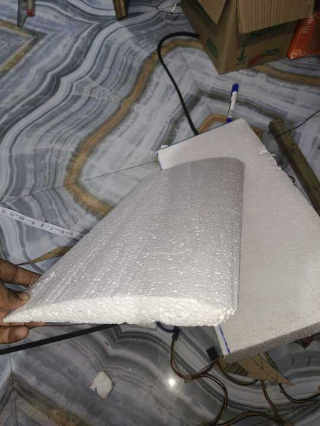
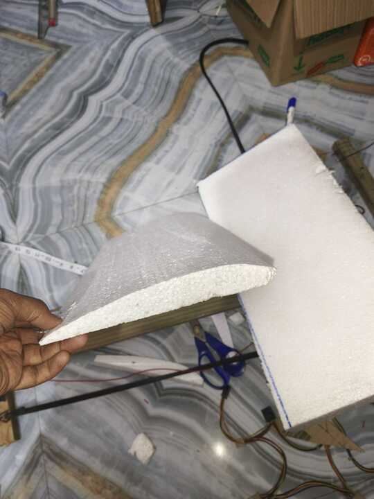
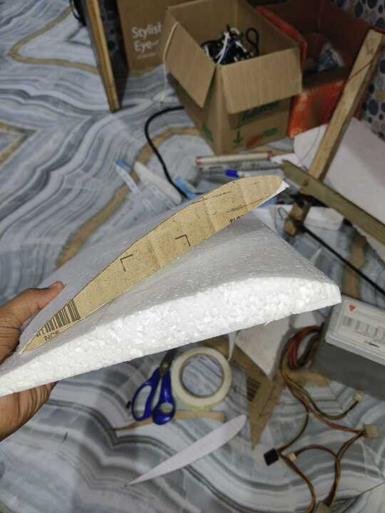
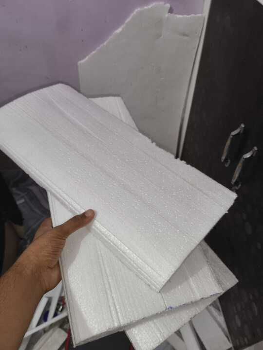
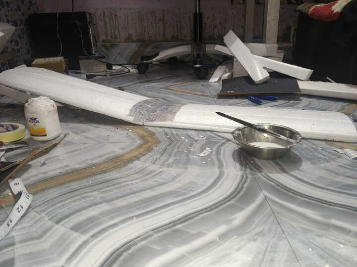
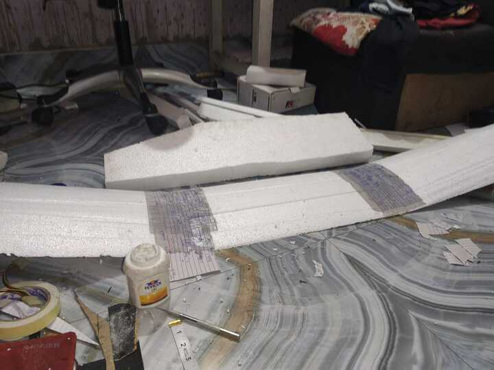
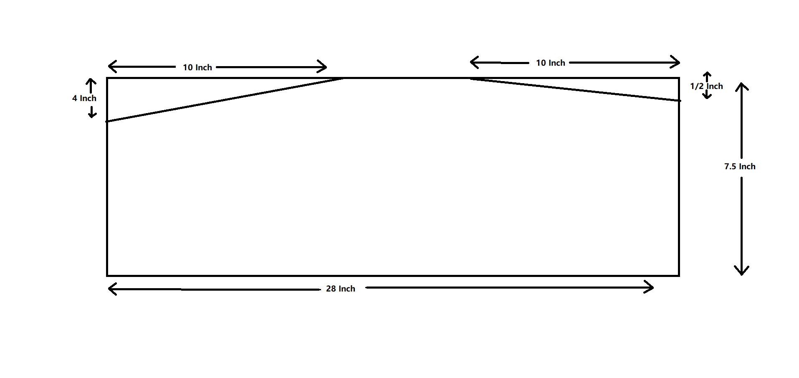
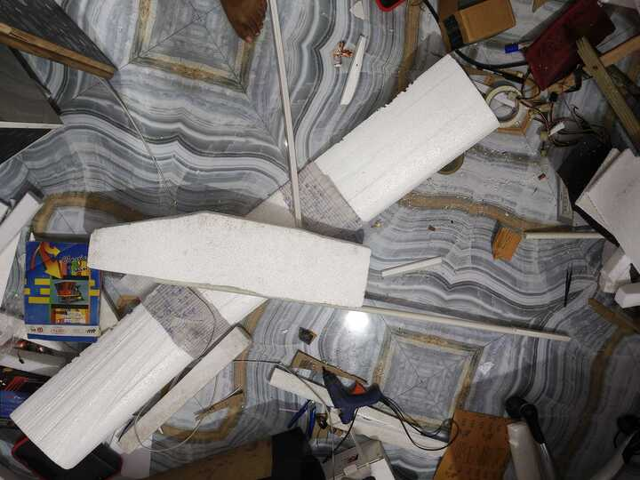

# Build Airplane

I've collected most of the stuff to build the Airplane

# 1st Hr 
Built a hot wire cutter to cut the Thermocol/Polystyrene sheets easily.

# Plan
The airplane wing consists of 3 part and in the upcoming 3 hours. I built them.

# 2nd Hr

# 3rd Hr

# 4th Hr

# 5th Hr
Filed the wings and joined them at an inclination.

# 6th Hr
Filed the other wings and joined them at an inclination. And cut the shape of fuselage

# 7th Hr
Filled the fuselage and joined it with 48 Inch PVC pipe

# 8th Hr

# 9th Hr

# 10th Hr

# 11th Hr

# 12th Hr

# 13th Hr

# 14th Hr

# 15th Hr
