# Build Airplane

"I've tried to build a remote-controlled plane whose wings collapsed😢"

I've collected most of the stuff to build the Airplane
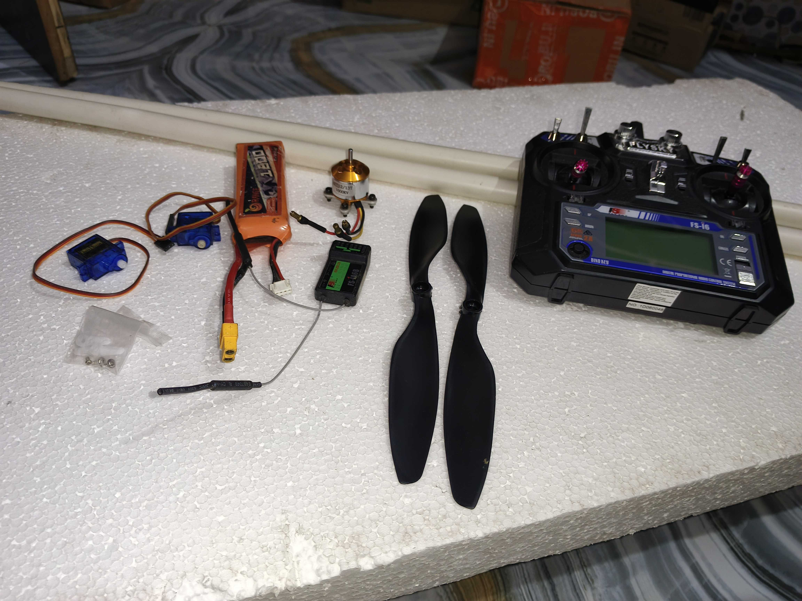

# 1st Hr 
Built a hot wire cutter to cut the Thermocol/Polystyrene sheets easily.

# Plan
The airplane wing consists of 3 part and in the upcoming 3 hours. I built them.

# 2nd Hr

# 3rd Hr

# 4th Hr

# 5th Hr
Filed the wings and joined them at an inclination.

# 6th Hr
Filed the other wings and joined them at an inclination. And cut the shape of fuselage

# 7th Hr
Filled the fuselage and joined it with 48 Inch PVC pipe

# 8th Hr
Made the horizontal and vertical stabliser
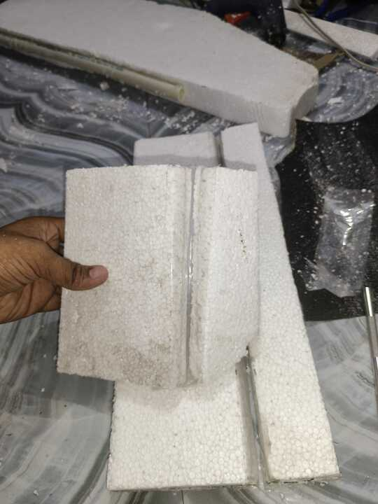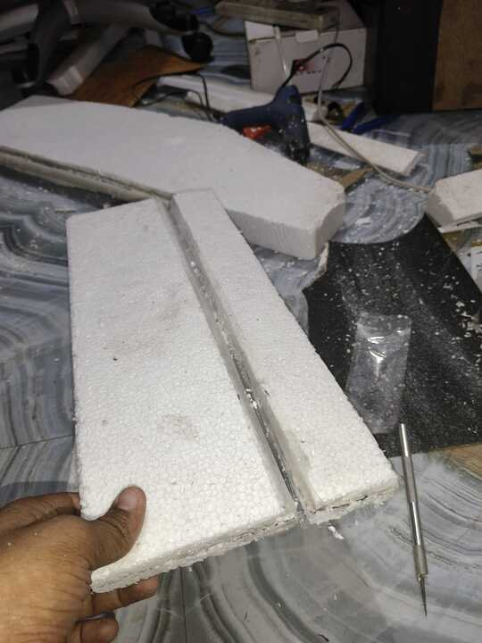

# 9th Hr
Cleaned my room

# 10th Hr
Extended the wires of Servos and ESC
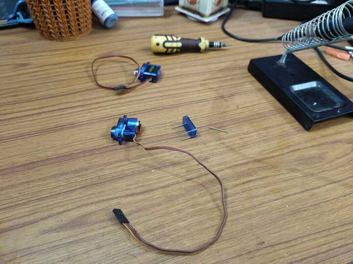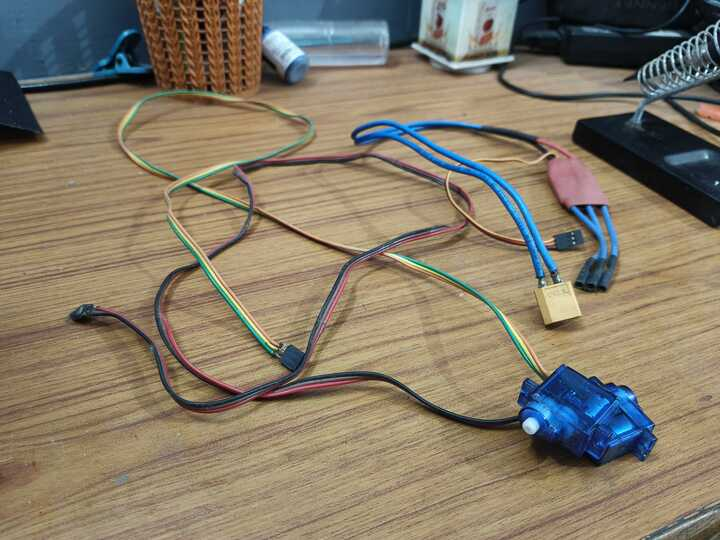

# 11th Hr
Made a mount for Brushless Motor and attached the Servos
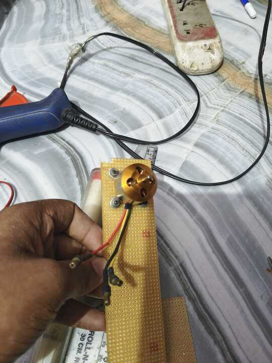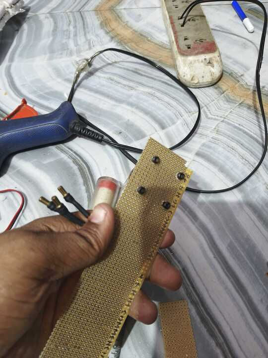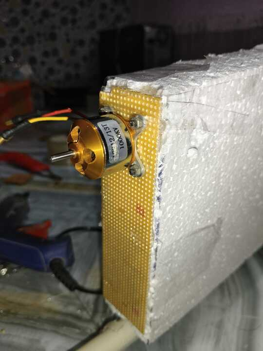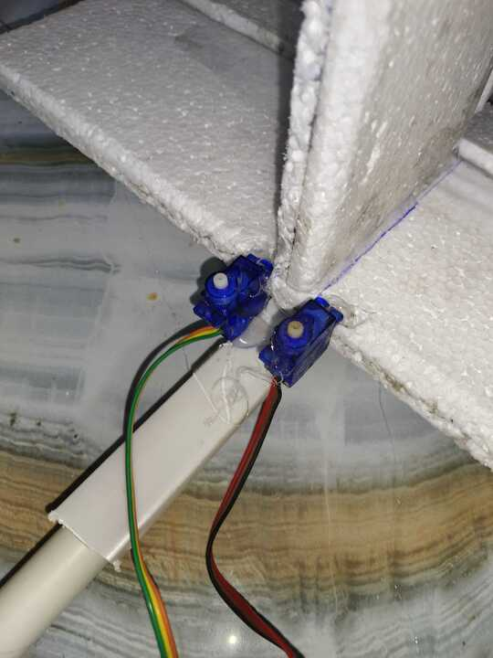

# 12th Hr
Made the control horns from veroboard and added popsicle sticks to the wing
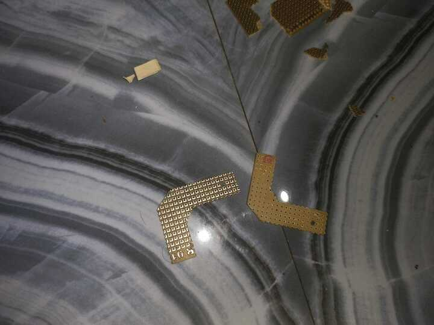

# 13th Hr
Attached the control horns to the stablisers and enlarged the holes of servo's flap. Attached pens to hold the wing
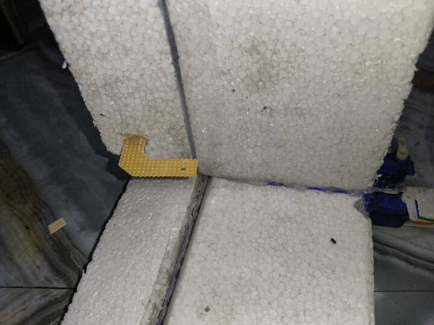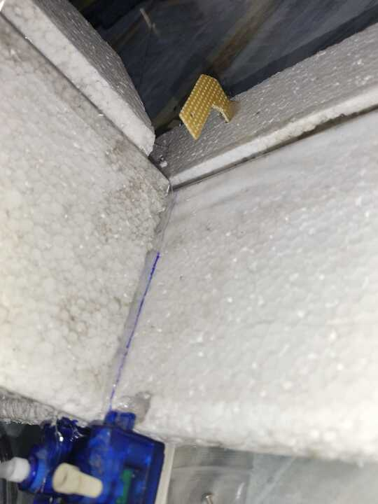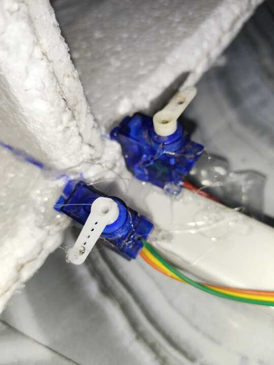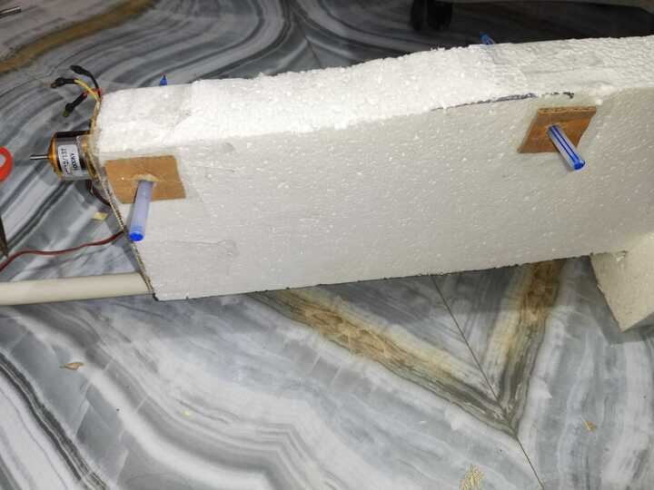
Trying to make a connector between the control horn and the servos
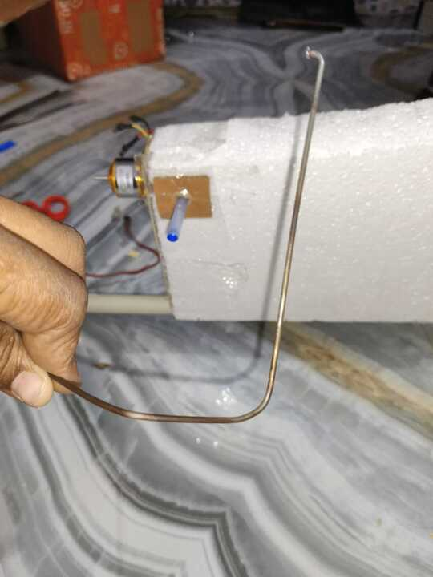

# 14th Hr
Connected the control horn and the servos

Solder of servo broke
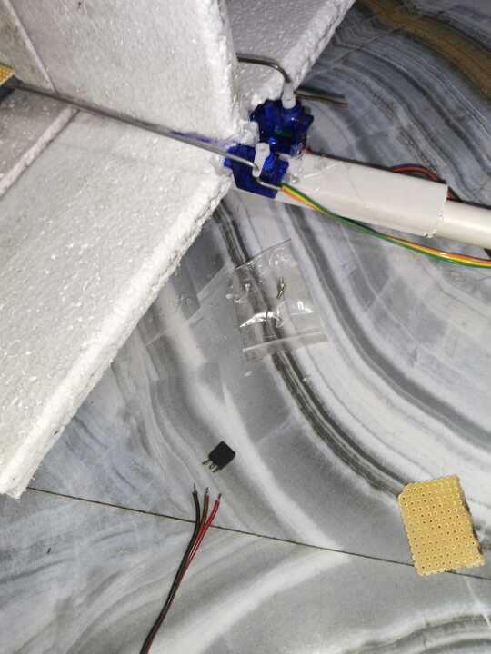
Soldered the wire of the servo
Connected the Motor and the Esc
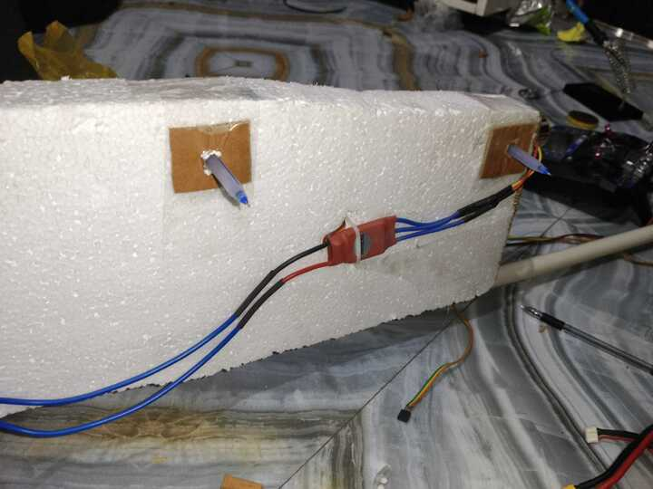

# 15th Hr
Completed the wiring

Mark the points to balance the whole 
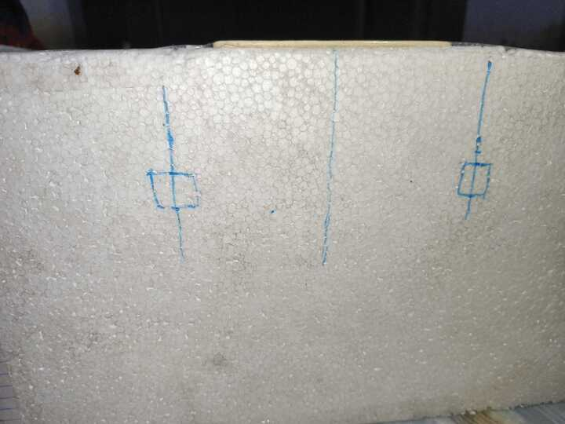
Testing the trusters

Connected the wing

# 16th Hr (Testing)
Show

#1 Test

#2 Test

#3 Test

